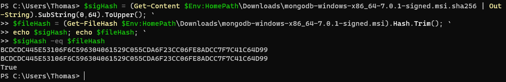

## Lab 3

### Installation

I had some problems with the installation, because installing mongoDB local required a domain account and password,
which did not work with the default input, so I used the network instead.

Verification:

### Experiment 1

Inserting

Query

Update

Delete

Bulk Write

### Experiment 2

I made an aggregation for finding orders whose price are higher than 50.

